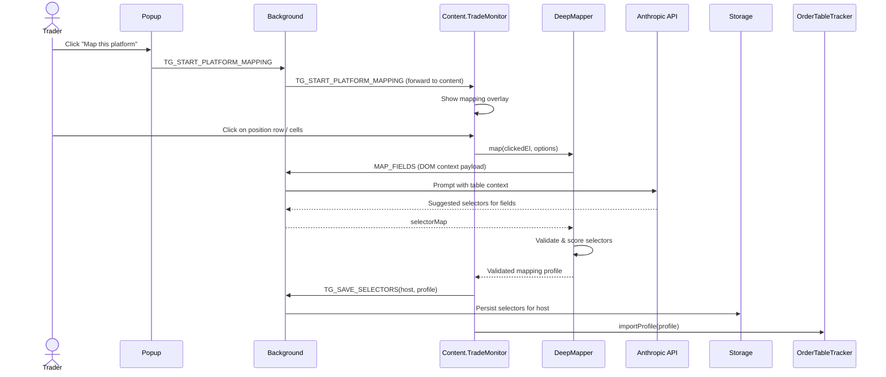
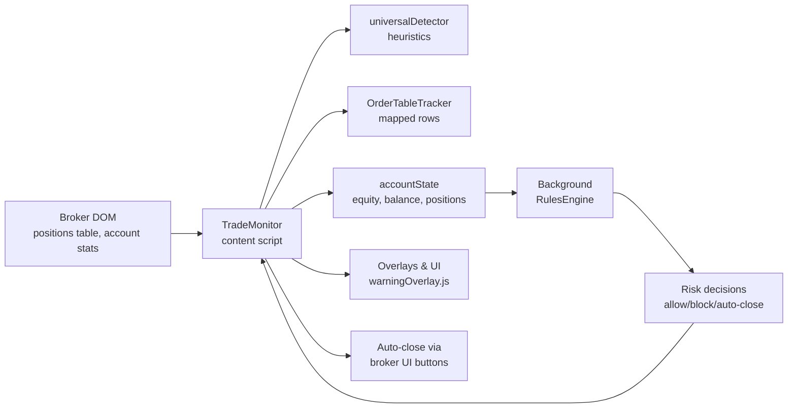

### TradeGuardX Architecture

TradeGuardX is a Chrome extension that sits on top of any broker’s web terminal, reads trades from the DOM, applies configurable risk rules, and shows advisory overlays before orders are sent. It is strictly **read-only and interceptive**: it never sends orders to the broker, it only blocks/permits user clicks and closes positions via the broker’s own UI.

- **Popup UI (`src/popup/popup.js`)**: configuration surface for risk rules, Anthropic API key, and mapping controls. Talks only to the background page via `chrome.runtime.sendMessage`.
- **Background (`src/background/background.js`)**: central service layer. Owns configuration and state storage, risk `RulesEngine`, and the Anthropic proxy used by `DeepMapper`. Routes messages between popup and content scripts.
- **Content scripts (`src/content/*.js`)**:
  - `universalDetector.js`: heuristics-only engine that understands generic trading UIs (symbols, sides, prices, SL/TP fields, close buttons).
  - `orderTableTracker.js`: mapped-only tracker that reads open positions from a mapped table and produces normalized trade objects.
  - `deep-mapper.js`: AI-assisted mapper; given a user click and local DOM context, it asks Claude for robust CSS selectors, validates them, and returns a mapping profile.
  - `tradeMonitor.js`: main orchestrator running on trading pages. Wires detectors, trackers, and risk rules; keeps `accountState.positions` in sync; intercepts Buy/Sell clicks; shows overlays via `warningOverlay.js`.
  - `content.js` and adapters: bootstrap and glue that inject shared libraries, attach a `TradeMonitor` to the page, and expose `window.TradeGuardX`.
- **Overlays (`src/overlay/warningOverlay.js`)**: shared overlay/ toast UI for SL reminder, blocked trade, closed-trade, and other risk messages. Called from `tradeMonitor.js`.
- **Storage & rules (`src/storage/*`, `src/rules/*`)**: configuration and runtime state persisted by the background page, and the risk engine that evaluates daily loss, per-trade risk, hedging, and auto-close behavior.

At runtime, only **content scripts** can see the broker DOM; the **background** page holds long‑lived state and performs risk evaluation; the **popup** is a thin, short‑lived configuration UI.

---

### Chrome extension lifecycle & manifest

TradeGuardX is a Manifest V3 Chrome extension, configured via `manifest.json`:

- **Basic metadata**
  - `manifest_version: 3` – uses the MV3 architecture (service worker background).
  - `name`, `description`, `version` – how the extension appears in Chrome and the Web Store.
  - `icons` – toolbar and extensions-page icons (`icons/logo.png` in multiple sizes).
- **Popup (`action`)**
  - `action.default_popup: src/popup/popup.html` – HTML shown when the user clicks the toolbar icon.
  - `action.default_title` and `action.default_icon` customize the button label and icon.
  - `popup.js` runs in this page and talks to the background using `chrome.runtime.sendMessage`.
- **Background service worker**
  - `background.service_worker: src/background/background.js` – event-driven “brain” of the extension.
  - `type: "module"` – allows ES module imports (e.g. `Storage`, `RulesEngine`).
  - Handles:
    - Install events (`chrome.runtime.onInstalled`) to ensure default config/state.
    - Messages like `TG_EVALUATE_ACCOUNT`, `TG_GET_CONFIG`, `TG_SAVE_CONFIG`, `TG_GET_SELECTORS`, `TG_SAVE_SELECTORS`,
      `TG_START_PLATFORM_MAPPING`, `MAP_FIELDS`, and Anthropic key management.
    - Network calls to Anthropic on behalf of `DeepMapper`.
- **Permissions**
  - `permissions: ["storage", "scripting", "activeTab", "tabs"]`:
    - `storage` – allows `chrome.storage` for config and state (wrapped by `Storage`).
    - `scripting` – permits programmatic script injection if needed.
    - `activeTab` – temporary access to the user’s currently active tab after interaction (used when starting mapping).
    - `tabs` – wider access to read/update tabs (used in `popup.js` via `chrome.tabs.query` / `chrome.tabs.update`).
- **Host permissions**
  - `host_permissions: ["<all_urls>", "https://api.anthropic.com/*"]`:
    - `<all_urls>` – lets Chrome inject content scripts into any page and allows reading tab URLs.
    - `https://api.anthropic.com/*` – enables the background to call Anthropic’s API for DeepMapper.
- **Content scripts**
  - A single `content_scripts` entry:
    - `matches: ["<all_urls>"]` – inject on all pages; detectors decide whether it’s a trading page.
    - `js` (load order):
      - `src/overlay/warningOverlay.js` – overlay and toast UI.
      - `src/content/universalDetector.js` – heuristics-only trade detection engine.
      - `src/content/deep-mapper.js` – DeepMapper mapping helper.
      - `src/adapters/baseAdapter.js`, `src/adapters/universalAdapter.js` – adapter layer for broker DOMs.
      - `src/content/domScanner.js` – DOM scanning utilities.
      - `src/content/orderTableTracker.js` – mapped positions table tracker.
      - `src/content/tradeMonitor.js` – main coordinator on trading pages.
      - `src/content/content.js` – bootstrap that wires everything onto `window.TradeGuardX`.
    - `run_at: "document_idle"` – scripts run after the page is mostly loaded, when DOM is stable enough to inspect.

Lifecycle summary:

1. Chrome reads `manifest.json` and installs TradeGuardX (registering the background worker, popup, and content scripts).
2. When the user opens the popup, `popup.html` + `popup.js` load and communicate with the background.
3. On any web page, Chrome injects the listed content scripts at `document_idle`.
4. `content.js` creates a `TradeMonitor` for that page, which uses `universalDetector`, `OrderTableTracker`, `DeepMapper`, and overlays.
5. As the trader interacts with the broker UI, content scripts send messages to the background for risk evaluation and mapping; the background responds with decisions and results.

---

### High-level runtime flow

1. **User opens a broker page**
   - `content.js` loads `universalDetector`, `OrderTableTracker`, `DeepMapper`, `TradeMonitor`, and the overlay system into the page.
   - A single `TradeMonitor` instance is created and `init()` is called.
2. **TradeMonitor bootstraps**
   - Attaches a `chrome.runtime.onMessage` handler for control messages.
   - Asks the background for stored selectors and mapping profiles for the current host.
   - If a mapping profile exists, `OrderTableTracker` imports it and starts in **strict mapped mode**.
3. **Monitoring loop**
   - `TradeMonitor` periodically scans the DOM and listens to `MutationObserver` events to keep `accountState` up to date:
     - Balance/equity/floating loss are read via mapped selectors.
     - Open positions are read via `OrderTableTracker.getTrades()` (mapped rows only).
   - When changes are detected (new/closed positions, equity changes), `TradeMonitor` sends `TG_EVALUATE_ACCOUNT` to the background.
4. **Risk evaluation in background**
   - Background retrieves config from `Storage`, runs `RulesEngine.evaluateAccount(accountState)`, and returns:
     - Risk metrics (daily limit, remaining loss, rule flags).
     - Decisions (e.g., block new trades, trigger auto-close, show over‑risk warnings).
   - Background also keeps derived state: last hooked host, active trades snapshot, counters for trades opened and loss sessions, etc.
5. **User clicks Buy/Sell**
   - `TradeMonitor` has previously located the Buy/Sell buttons (via `universalDetector`) and wrapped them with its own `onTradeClick` handler.
   - On click, it:
     - Reads the currently selected symbol, volume, SL/TP, and price from the DOM.
     - Runs hedging checks (no opposite-side on same symbol when hedging rule is on).
     - Sends a fresh `TG_EVALUATE_ACCOUNT` request including the pending trade.
   - Based on the result, `TradeMonitor` either lets the original click proceed or **blocks it** and shows a warning/blocked overlay.
6. **Overlays & auto-close**
   - When risk rules are breached (daily limit reached, high stacking, no SL, etc.), `TradeMonitor` calls helpers from `warningOverlay.js`:
     - `showNoStopLossOverlay` for SL reminders on a specific symbol.
     - `showWarningOverlay` / `showBlockedTradeOverlay` for per-trade and account-wide blocks.
     - `showTradeClosedOverlay` and toasts when auto-close routines complete.
   - In certain cases, `TradeMonitor` also triggers **auto-close** by clicking the broker’s own close buttons, using selectors discovered by `universalDetector` or mapping profiles.

---

### Mapping and DeepMapper flow

TradeGuardX relies on **mapped selectors** rather than brittle heuristics for positions tables and key fields:

- The popup exposes a “Map this platform” control that sends `TG_START_PLATFORM_MAPPING` to the active tab.
- `content.js` forwards this to the page-scoped `TradeMonitor`, which calls `startGuidedPlatformMapping()`.
- `TradeMonitor` then:
  - Renders a mapping overlay on top of the broker UI.
  - Lets the user click on representative rows/fields (symbol, side, SL, TP, PnL, close button, etc.).
  - For each click, constructs a `DeepMapper` instance and calls `map(clickedElement, options)`.
- `DeepMapper`:
  - Extracts a rich context window: header row, several neighboring rows, serialized DOM snippets, and attribute maps.
  - Sends a prompt with this context to the background via a `MAP_FIELDS` message.
  - The background proxies this to Anthropic (Claude), receives suggested selectors, and returns them to the content script.
  - DeepMapper validates the selectors against the live DOM, scores them, and may run a second “fix” pass if some fields failed validation.
- When a profile is ready, `TradeMonitor` persists it via `TG_SAVE_SELECTORS`, and `OrderTableTracker.importProfile()` switches into strict mapped mode for that host.

Sequence diagram (simplified):

Once mapping is complete, `TradeMonitor` treats the host as **mapped-only** for rows and critical fields, and turns off heuristic discovery for the positions table.

---

### Trade tracking and risk loop

The main runtime loop for trade tracking and risk evaluation can be summarized as:

- **DOM → TradeMonitor**: reads mapped numbers (equity, balance, floating loss) and uses `OrderTableTracker` to keep a list of normalized positions.
- **TradeMonitor → Background**: sends `TG_EVALUATE_ACCOUNT` with `accountState` and, when relevant, the pending trade.
- **Background RulesEngine → TradeMonitor**: returns configuration‑aware decisions (daily loss exceeded, per‑trade risk too high, hedging violation, etc.).
- **TradeMonitor → UI**: shows overlays, blocks/permits clicks, and optionally clicks broker close buttons to flatten risk.

For deeper details, see:

- `docs/mapping-flow.md` – guided mapping and DeepMapper/Claude integration.
- `docs/trade-tracking-flow.md` – how `OrderTableTracker` and `TradeMonitor` cooperate to track open positions.
- `docs/risk-rules-and-hedging.md` – configuration options and decision logic.
- `docs/overlays-and-ui.md` – overlay variants and usage.
- `docs/files-*.md` – per‑file summaries for core modules.
- `docs/junior-getting-started.md` and `docs/junior-tasks-examples.md` – onboarding guides.
- `docs/design-decisions.md` and `docs/extensibility.md` – key architectural trade‑offs and how to add new brokers.

