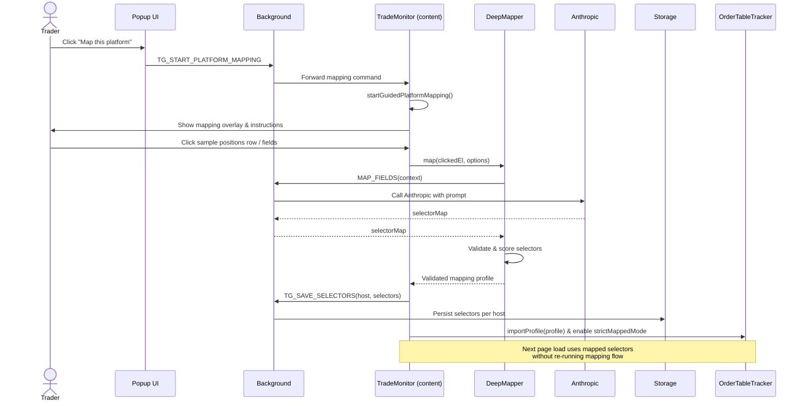

### Mapping flow and DeepMapper/Claude integration

TradeGuardX is **mapped-first**: for each broker host, it prefers robust, AI-generated selectors over brittle heuristics. Mapping is a one‑time (per host) flow that produces a reusable profile consumed by `OrderTableTracker` and `TradeMonitor`.

At a high level:

- The user initiates mapping from the popup.
- The background forwards a mapping command to the active tab.
- The content script (`TradeMonitor`) shows a mapping overlay.
- The user clicks representative rows and cells in the broker’s positions table.
- `DeepMapper` extracts local DOM context and asks Anthropic (Claude) for selectors.
- The background saves the resulting selectors as a mapping profile keyed by host.

---

### Entry point from popup

The popup exposes a “Map this platform” style control that:

- Finds the active tab.
- Sends `TG_START_PLATFORM_MAPPING` to that tab’s content scripts.

Code reference:

```1:34:src/popup/popup.js
function startMappingOnActiveTab() {
  return new Promise((resolve) => {
    try {
      chrome.tabs.query({ active: true, currentWindow: true }, (tabs) => {
        const activeTab = tabs && tabs[0];
        if (!activeTab?.id) {
          resolve({ success: false, error: 'No active tab found' });
          return;
        }
        chrome.tabs.update(activeTab.id, { active: true });
        chrome.tabs.sendMessage(activeTab.id, { type: 'TG_START_PLATFORM_MAPPING' }, (response) => {
          if (chrome.runtime?.lastError) {
            resolve({ success: false, error: chrome.runtime.lastError.message || 'Unable to reach tab' });
            return;
          }
          resolve(response && typeof response === 'object' ? response : { success: true });
        });
      });
    } catch (err) {
      resolve({ success: false, error: err?.message || 'Failed to start mapping' });
    }
  });
}
```

The background script listens for this message type and forwards the intent into the page via `content.js` and the bound `TradeMonitor` instance.

---

### TradeMonitor mapping session

`TradeMonitor` is responsible for:

- Keeping track of whether a host is already mapped (`_hasSavedMappingForHost`, `_isMappedCrawlMode`).
- Watching for likely trading pages and prompting guided mapping when appropriate (`_startMappingEligibilityWatcher`, `_maybeAutoStartGuidedMapping`).
- Running a **guided mapping session** (`startGuidedPlatformMapping`), which:
  - Renders an overlay on the broker DOM explaining which elements to click.
  - Collects user clicks on the positions table row/cells.
  - For each click, constructs a `DeepMapper` and calls `map(clickedEl, options)`.

Key mapping-related bits:

```62:81:src/content/tradeMonitor.js
async init() {
  if (!this.detector) return;
  this._attachRuntimeHandlers();
  await this.loadSavedOrderIdentity();
  if (window.OrderTableTracker && !this._orderTracker) {
    this._orderTracker = new window.OrderTableTracker(this.detector, {
      host: window.location.hostname
    });
    if (this._loadedSelectors?.order_profile) {
      this._orderTracker.importProfile(this._loadedSelectors.order_profile);
    }
  }
  this._requiresMapping = !this._hasSavedMappingForHost();
  if (this._requiresMapping) {
    this._startMappingEligibilityWatcher();
    return;
  }
  this._stopMappingEligibilityWatcher();
  this._startMonitoringLoops();
}
```

```148:175:src/content/tradeMonitor.js
_startMappingEligibilityWatcher() {
  if (this._mappingEligibilityTimer) return;
  if (!/^https?:/i.test(window.location.protocol || '')) return;
  if (this._hasSavedMappingForHost()) return;

  const tick = () => {
    if (this._hasSavedMappingForHost()) {
      this._requiresMapping = false;
      this._stopMappingEligibilityWatcher();
      return;
    }
    if (this._isMappingActive()) return;
    if (!this._isLikelyBrokerTradingPage()) return;
    if (this._mappingPromptedOnce) return;

    this._mappingPromptedOnce = true;
    this.startGuidedPlatformMapping().catch(() => {
      this._mappingPromptedOnce = false;
    });
    if (typeof showToast === 'function') {
      showToast('Broker terminal detected. Map this platform once to start detection.', 'info');
    }
  };

  tick();
  this._mappingEligibilityTimer = window.setInterval(tick, 2000);
}
```

Once mapping is complete, `TradeMonitor` marks the loaded selectors as complete and will no longer re‑prompt automatically for this host.

---

### DeepMapper: extracting DOM context

`DeepMapper` is a content-side helper that converts a **single user click** into a rich description of the local table:

- Determines the row representing the clicked trade (`_findRowAncestor`).
- Locates the surrounding table and header row.
- Serializes header and a small window of rows (HTML snippets).
- Extracts cell metadata (text, attributes, tags) and a dense “row value map”.
- Optionally incorporates **manual selections** as hints (for example, when the user manually points at SL or TP cells).

Core entry point:

```15:32:src/content/deep-mapper.js
async map(clickedEl, options = {}) {
  const manualSelections = options?.manualSelections || {};
  const context = this._extractDeepContext(clickedEl, manualSelections, options || {});
  if (!context) throw new Error('Could not find a trade table near the clicked element');

  const selectorMap = await this._askClaude(context);
  let validated = this._validateAndScore(selectorMap, context.rowEl);
  const failed = this._collectFailedSelectors(validated);

  if (failed.length > 0) {
    const fixedMap = await this._askClaudeFix(context, selectorMap, failed);
    const fixedValidated = this._validateAndScore(fixedMap, context.rowEl);
    validated = this._mergeValidated(validated, fixedValidated);
  }

  this.onComplete(validated);
  return validated;
}
```

Context extraction:

```34:73:src/content/deep-mapper.js
_extractDeepContext(clickedEl, manualSelections = {}, options = {}) {
  const forcedRowEl =
    options?.forcedRowEl instanceof HTMLElement && options.forcedRowEl.isConnected
      ? options.forcedRowEl
      : null;
  const rowEl = forcedRowEl || this._findRowAncestor(clickedEl);
  if (!rowEl) return null;
  const broadContext = options?.broadContext === true;

  const tableEl =
    rowEl.closest('table') ||
    rowEl.closest('[role="table"]') ||
    rowEl.parentElement;

  const headerEl =
    tableEl?.querySelector('thead tr, thead, tr:first-child') ||
    this._findHeaderRow(tableEl);

  const maxRows = broadContext ? 8 : 3;
  const allRows = Array.from(tableEl?.querySelectorAll(this._guessRowSelector(rowEl)) || [])
    .filter((r) => r !== headerEl)
    .slice(0, maxRows);

  return {
    clickedEl,
    rowEl,
    tableEl,
    headerEl,
    allRows,
    broadContext,
    focusFields: Array.isArray(options?.focusFields) ? options.focusFields : [],
    manualSelections,
    manualSelectionHints: this._buildManualSelectionHints(manualSelections, rowEl),
    rowValueMap: this._buildRowValueMap(rowEl),
    headerHTML: headerEl ? this._serializeEl(headerEl, 3) : null,
    rowHTMLs: allRows.map((r) => this._serializeEl(r, 6)),
    tableWindowHTML: broadContext ? this._serializeTableWindow(tableEl, headerEl, allRows) : null,
    headerCells: this._extractCells(headerEl),
    rowCells: this._extractCells(rowEl)
  };
}
```

This context is shipped (via background) to Anthropic, which returns candidate CSS selectors (e.g. for symbol, side, entry price, SL, TP, PnL, close button).

---

### Background Anthropic proxy

Because content scripts cannot call external network APIs directly, DeepMapper relies on the background:

- `background.js` exposes a `MAP_FIELDS` message type.
- It receives the context payload and uses a `RulesEngine`/helper module to call Anthropic’s API with the appropriate prompt and model.
- The Anthropic API key is stored via the popup (`TG_SET_ANTHROPIC_API_KEY`) using `Storage`.
- The background returns a selector map back to the content side, which DeepMapper then validates.

The details of prompt construction live in the rules/mapping helpers, but from the content script’s perspective, `DeepMapper._askClaude` is an async black box that:

- Sends serialized context.
- Receives a map `{ fieldKey -> selector string }`.

---

### Profile validation, scoring, and persistence

After receiving a raw selector map from Claude, DeepMapper:

- Attempts to resolve each selector relative to the mapped row/table.
- Scores selectors based on whether they are unique, stable, and actually resolve to the right cells.
- Collects any failed fields and runs a **fix** pass by calling Anthropic again with explicit “these fields failed” hints.
- Merges the fixed results back into a final, validated profile and calls `onComplete`.

`TradeMonitor` then:

- Takes the validated profile object (including per-field selectors and meta).
- Wraps it into a host-specific selectors structure.
- Sends `TG_SAVE_SELECTORS` to the background, which uses `Storage` to persist selectors keyed by hostname.
- Calls `OrderTableTracker.importProfile(profile)` so that ongoing trade tracking uses **strict mapped mode** (no heuristics for row discovery; only mapped container/field selectors).

Once persisted, on the next page load:

- Background returns the saved selectors via `TG_GET_SELECTORS`.
- `TradeMonitor.init()` imports them into `OrderTableTracker` and marks `mapping_complete === true`.
- The mapping eligibility watcher is disabled, and the platform is treated as fully mapped.

---

### Mapping flow sequence diagram



