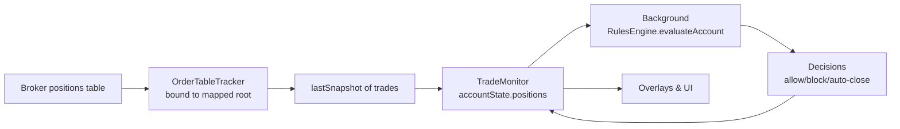

### Trade tracking and strict mapped mode

This document explains how TradeGuardX discovers open positions, keeps them updated, and feeds a normalized `positions` list into the risk engine. The key pieces are:

- `OrderTableTracker` (`src/content/orderTableTracker.js`) – binds to a mapped positions table, discovers rows, and reads per-row trade data.
- `TradeMonitor` (`src/content/tradeMonitor.js`) – orchestrator that owns `accountState` and passes positions to the background risk engine.
- Mapping profiles – selectors produced by `DeepMapper` and stored per host, enabling **strict mapped mode** for row discovery.

---

### OrderTableTracker overview

`OrderTableTracker` is a DOM watcher specialized for positions tables:

- It binds to a root table/container element (usually chosen during mapping).
- It learns a header map (which column holds symbol, side, entry, SL, TP, PnL, etc.).
- It keeps a `profiles` map keyed by **row IDs** (stable identifiers for each open trade).
- It tracks which rows disappear and garbage-collects stale profiles.
- It returns a normalized list of trade objects (symbol, side, prices, SL/TP, PnL, close button, etc.) via `getTrades()`.

Constructor and import/export:

```24:41:src/content/orderTableTracker.js
class OrderTableTracker {
  constructor(detector, options = {}) {
    this.detector = detector;
    this.host = options.host || window.location.hostname;
    this.root = null;
    this.rowsRoot = null;
    this.observer = null;
    this.profiles = new Map();
    this.lastSnapshot = [];
    this._debounceTimer = null;
    this._headerMap = null;
    this._profileSeed = null;
    this._rowSelectorHint = null;
    this._rowSelector = null;
    this._strictMappedMode = false;
    this._negativePatterns = [...NEGATIVE_ROW_PATTERNS];
    this._lastDiscoveryStats = null;
  }
```

```43:81:src/content/orderTableTracker.js
importProfile(profile) {
  if (!profile || profile.version !== PROFILE_VERSION) return;
  const cleanedBindings = {};
  const rawBindings = profile.fieldBindings || {};
  FIELD_KEYS.forEach((key) => {
    const b = rawBindings[key];
    if (!b || typeof b.selector !== 'string' || !b.selector.trim()) return;
    cleanedBindings[key] = {
      selector: b.selector.trim(),
      confidence: Number.isFinite(Number(b.confidence)) ? Number(b.confidence) : 0.8,
      source: b.source || profile.source || 'profile_seed'
    };
  });
  this._profileSeed = {
    ...profile,
    fieldBindings: cleanedBindings
  };
  const hasSeedBindings = Object.keys(cleanedBindings).length > 0;
  this._strictMappedMode =
    profile.strictMappedMode === true ||
    profile.source === 'guided_mapping' ||
    hasSeedBindings;
  if (Array.isArray(profile.negativeRowPatterns)) {
    this._negativePatterns = [
      ...NEGATIVE_ROW_PATTERNS,
      ...profile.negativeRowPatterns
        .map((p) => {
          try {
            return new RegExp(p, 'i');
          } catch (_err) {
            return null;
          }
        })
        .filter(Boolean)
    ];
  }
  this._rowSelectorHint = profile.rowSelectorHint || null;
  this._rowSelector = profile.rowSelector || null;
}
```

`exportProfile()` combines data learned at runtime into a compact profile that can be stored per host and later re-imported on page load.

---

### Binding to the positions table

`OrderTableTracker.bind(rootEl)` attaches the tracker to a specific DOM container:

- Stores `root` and `rowsRoot` (usually `<tbody>` or the root itself).
- Learns the header map by scanning the first header row and matching header texts to known fields.
- Starts a `MutationObserver` to refresh when rows change.

```117:129:src/content/orderTableTracker.js
bind(rootEl) {
  if (!(rootEl instanceof HTMLElement)) return false;
  if (this.root === rootEl) return true;
  this.disconnect();
  this.root = rootEl;
  this.rowsRoot = rootEl.querySelector('tbody') || rootEl;
  this._rowSelectorHint = this._profileSeed?.rowSelectorHint || (this.rowsRoot?.tagName === 'TBODY' ? 'tr' : null);
  this._rowSelector = this._profileSeed?.rowSelector || this._rowSelector || null;
  this._headerMap = this._learnHeaderMap(rootEl);
  this._refreshNow();
  this._startObserver();
  return true;
}
```

Header learning:

```207:225:src/content/orderTableTracker.js
_learnHeaderMap(root) {
  const table = root.tagName === 'TABLE' ? root : root.querySelector('table');
  if (!table) return null;
  const headerRow = table.querySelector('thead tr') || table.querySelector('tr');
  if (!headerRow) return null;
  const cells = Array.from(headerRow.querySelectorAll('th, td'));
  if (cells.length === 0) return null;

  const map = {};
  const aliases = {};
  cells.forEach((cell, idx) => {
    const label = (cell.innerText || '').trim().toLowerCase();
    if (!label) return;
    aliases[idx] = label;
    const field = this._fieldFromHeader(label);
    if (field && map[field] == null) map[field] = idx;
  });
  return { map, aliases };
}
```

---

### Discovering and tracking rows

The core refresh logic:

- `_discoverRows(rowsRoot)` finds all candidate rows.
  - In **strict mapped mode**, it:
    - Prefers a configured `rowSelector` / `rowSelectorHint`.
    - Falls back to only those rows inside the mapped container where mapped field selectors resolve.
  - Outside strict mode, it can fall back to broader heuristics.
- For each row, `_getRowId(row, idx)` produces a stable row ID used as a key in `profiles`.
- `profiles` entries track per-row bindings and missing counts (to remove gone rows).
- `_readTradeFromRow(profile, rowEl)` converts a row into a normalized trade object.

Snapshot refresh:

```169:205:src/content/orderTableTracker.js
_refreshNow() {
  if (!this.rowsRoot) return;
  const rows = this._discoverRows(this.rowsRoot);
  const seen = new Set();
  const rowById = new Map();

  rows.forEach((row, idx) => {
    const rowId = this._getRowId(row, idx);
    seen.add(rowId);
    rowById.set(rowId, row);
    const existing = this.profiles.get(rowId);
    if (!existing) {
      this.profiles.set(rowId, this._createProfile(row, rowId));
    } else {
      existing.missingCount = 0;
      existing.rowSelector = this._selector(row) || existing.rowSelector;
      this._refreshProfileBindings(existing, row);
    }
  });

  for (const [rowId, profile] of this.profiles.entries()) {
    if (!seen.has(rowId)) {
      profile.missingCount = (profile.missingCount || 0) + 1;
      if (profile.missingCount >= 3) this.profiles.delete(rowId);
    }
  }

  const snapshot = [];
  for (const profile of this.profiles.values()) {
    const rowEl = rowById.get(profile.rowId) || this._resolveRow(profile);
    if (!rowEl) continue;
    const trade = this._readTradeFromRow(profile, rowEl);
    if (!trade) continue;
    snapshot.push(trade);
  }
  this.lastSnapshot = snapshot;
}
```

`getTrades()` simply ensures a fresh refresh and returns `lastSnapshot`.

---

### Strict mapped mode

Strict mapped mode is a core safety feature:

- It ensures TradeGuardX reads trades **only** from explicitly mapped containers and selectors.
- It avoids guessing at rows elsewhere on the page (e.g. watchlists, order history) once a host is mapped.
- It is enabled when:
  - `profile.strictMappedMode === true`, or
  - `profile.source === 'guided_mapping'`, or
  - the profile has any non-empty `fieldBindings`.

Row discovery in strict mode:

```240:259:src/content/orderTableTracker.js
_discoverRows(root) {
  if (!root) return [];
  if (this._strictMappedMode) {
    const strictSelector = this._rowSelector || this._rowSelectorHint;
    const normalizeRows = (nodes) =>
      Array.from(nodes || []).filter((row) => row instanceof HTMLElement && row.isConnected);
    if (strictSelector) {
      try {
        const strictRows = normalizeRows(root.querySelectorAll(strictSelector));
        if (strictRows.length > 0) return strictRows;
      } catch (_err) {
        // continue to mapped-only fallback below
      }
    }

    // Mapped-only fallback: discover rows inside mapped container and keep only rows
    // where mapped field selectors resolve. No full-page heuristics.
    const mappedSelectors = Object.values(this._profileSeed?.fieldBindings || {})
      .map((b) => b?.selector)
      .filter((s) => typeof s === 'string' && s.trim());
    if (mappedSelectors.length === 0) return [];
```

`_discoverRows` continues by narrowing down candidates to those that satisfy mapped field selectors, plus filtering out negative rows (summary/fees/etc.) based on `_negativePatterns`.

This mode ensures that once a broker is mapped, TradeGuardX:

- Does not switch back to heuristics for positions.
- Only tracks rows that look like real positions under the mapped container.

---

### TradeMonitor and accountState.positions

`TradeMonitor` owns the conceptual account state:

- `accountState` includes equity, balance, floating loss, starting equity, and `positions`.
- It periodically runs `runFullScan()` and `startTradesObservation()` to keep this state up to date.
- When mapping is loaded, it wires `OrderTableTracker` and uses it as the **sole** source of positions.

Initialization (mapping + tracker wiring):

When the host is not mapped, `init()` returns after a console warning — mapping is started only from the popup (**Map this host**). When mapped, it calls `_startMonitoringLoops()` as before.

Monitoring loop entry:

```84:113:src/content/tradeMonitor.js
_startMonitoringLoops() {
  if (this._monitoringStarted) return;
  this._monitoringStarted = true;
  this.runFullScan();
  this._maybeAutoRemapIfUnhooked();

  if (document.body && !this._observer) {
    const debouncedScan = debounce(() => this.runFullScan(), 300);
    this._observer = new MutationObserver(() => {
      debouncedScan();
    });
    this._observer.observe(document.body, {
      childList: true,
      subtree: true,
      characterData: true
    });
  }

  this.startTradesObservation();
  if (!this._scanIntervalId) {
    this._scanIntervalId = window.setInterval(() => this.runFullScan(), 2000);
  }
  this.startProfitWatcher();
  if (!this._overRiskReminderId) {
    setTimeout(() => this.checkOverRiskReminder(), 8000);
    this._overRiskReminderId = window.setInterval(() => this.checkOverRiskReminder(), 60000);
  }
  this.attachTradeButtons();
}
```

Inside its scan logic (not reproduced here in full), `TradeMonitor`:

- Uses mapped selectors to read account metrics (balance/equity/floating loss).
- Calls `this._orderTracker.getTrades()` to obtain a list of positions.
- Updates `this.accountState.positions` with normalized trade objects.
- Detects changes and sends `TG_EVALUATE_ACCOUNT` to the background when positions/equity change.

---

### Flow diagram: positions table → risk engine



In **strict mapped mode**:

- `OrderTableTracker` only considers rows under the mapped container and with mapped field selectors resolving.
- `TradeMonitor` never falls back to heuristic row discovery for the positions table.
- Risk rules operate on a clean, normalized list of real open positions, reducing noise from non-position rows.

